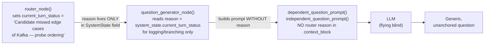

# Bug Fix Plan: Router Reason Propagation to Question Generator

> [!IMPORTANT]
> **Status**: Confirmed — Root causes verified against live source files.

---

## 1. Bug Confirmation: Is the Report Correct?

**Yes. 100% confirmed.** After reading every relevant source file, the reported bug is real and precisely described. Here is what the code actually does today:



The `reason` string is extracted at [agent.py L37](file:///Users/sufi_spryzen/Knowledge%20Base/Dev_Workspace/Projects/SkillIssue/SkillIssue.ai/src/agents/question_generator/agent.py#L37) and logged at [agent.py L51](file:///Users/sufi_spryzen/Knowledge%20Base/Dev_Workspace/Projects/SkillIssue/SkillIssue.ai/src/agents/question_generator/agent.py#L51), but it is **never passed** into either prompt builder.

---

## 2. Root Cause Analysis

### Root Cause 1 — The `reason` is orphaned after extraction
**File**: [question_generator/agent.py](file:///Users/sufi_spryzen/Knowledge%20Base/Dev_Workspace/Projects/SkillIssue/SkillIssue.ai/src/agents/question_generator/agent.py)

```python
# L37 — reason is read …
reason = system_state.current_turn_status

# L55 — … used only for branching logic (TOPIC CHANGED check) …
if reason == "TOPIC CHANGED":
    ...

# L153 — … but NEVER forwarded to dependent_question_prompt
messages = dependent_question_prompt(
    current_phase_summary=current_phase_summary,
    previous_k_turns=chat_history,
    user_summary=user_summary,
    jd=jd,
    phase=current_phase,
    # ← reason is absent here
)

# L220 — … and also absent from independent_question_prompt
messages = independent_question_prompt(
    previous_phase_summaries=phase_summary,
    user_summary=user_summary,
    previous_k_turns=chat_history,
    jd=jd,
    phase=current_phase,
    topic=topic,
    # ← reason is absent here too
)
```

### Root Cause 2 — Prompt builders have no `router_reason` parameter
**File**: [question_generator/prompt.py](file:///Users/sufi_spryzen/Knowledge%20Base/Dev_Workspace/Projects/SkillIssue/SkillIssue.ai/src/agents/question_generator/prompt.py)

Both `dependent_question_prompt(...)` and `independent_question_prompt(...)` have **no signature slot** for the router's reason, so even if the caller wanted to pass it, there's no contract for it.

```python
# L25 — no router_reason param
def independent_question_prompt(
    previous_phase_summaries, user_summary, previous_k_turns, jd, phase, topic
) -> list:
    ...
    context_block = f"""...
RECENT CHAT CONTEXT (previous k turns):
{previous_k_turns_json}
"""   # ← router_reason never appended

# L109 — same omission
def dependent_question_prompt(
    current_phase_summary, previous_k_turns, user_summary, jd, phase
) -> list:
    ...
    context_block = f"""...
RECENT CHAT CONTEXT (previous k turns):
{previous_k_turns_json}
"""   # ← router_reason never appended
```

### Root Cause 3 — The Router's `reason` field is rich but wasted
**File**: [router/prompt.py](file:///Users/sufi_spryzen/Knowledge%20Base/Dev_Workspace/Projects/SkillIssue/SkillIssue.ai/src/agents/router/prompt.py)

The router system prompt at [router/prompt.py L93–L102](file:///Users/sufi_spryzen/Knowledge%20Base/Dev_Workspace/Projects/SkillIssue/SkillIssue.ai/src/agents/router/prompt.py#L93-L102) explicitly instructs the routing LLM to produce a high-signal `reason`:

- **If dependent**: name the specific prior turn(s) and state what is missing/unclear.
- **If independent**: state what new angle or sub-topic to cover.

This is a rich, targeted directive — but none of it reaches the Question Generator. The Router is writing a brief for a colleague who never reads it.

### Root Cause 4 — Affects all three branch paths
The `TOPIC CHANGED` branch at [agent.py L87–L94](file:///Users/sufi_spryzen/Knowledge%20Base/Dev_Workspace/Projects/SkillIssue/SkillIssue.ai/src/agents/question_generator/agent.py#L87-L94) also calls `independent_question_prompt` without the reason. While `TOPIC CHANGED` is a structural trigger (not a qualitative one), it is still missing. All three branches are affected:

| Branch | Prompt Called | `reason` Passed? |
|---|---|---|
| `TOPIC CHANGED` | `independent_question_prompt` | ❌ No |
| `DEPENDENT` | `dependent_question_prompt` | ❌ No |
| `INDEPENDENT` | `independent_question_prompt` | ❌ No |

---

## 3. Impact Assessment

| Symptom | Cause |
|---|---|
| Follow-up questions are generic ("Tell me more about…") | LLM has no directive — falls back to vague probing |
| Follow-ups repeat what was already asked | LLM re-derives context from chat history alone, not from router's targeted gap analysis |
| Independent questions miss the intended angle | Router's "new sub-topic" suggestion is lost |
| Router intelligence is silently discarded | No downstream agent consumes the reason |

---

## 4. The Fix

### Strategy
Pass `router_reason: str` as a new parameter into both prompt builders and inject it into the `context_block` of the `HumanMessage` with an explicit **"ROUTER DIRECTIVE"** section. This gives the Question Generator LLM a pinned, prioritized instruction before it reads any chat history.

### Files to Change

| File | Change |
|---|---|
| `src/agents/question_generator/prompt.py` | Add `router_reason` param to both functions; inject into `context_block` |
| `src/agents/question_generator/agent.py` | Forward `reason` when calling both prompt builders in all 3 branches |

> [!NOTE]
> No changes needed to `router/agent.py`, `router/prompt.py`, `states.py`, or any other file. The `reason` already exists on `SystemState.current_turn_status` — it just needs to flow downstream.

---

## 5. Implementation Checklist

### Step 1 — Update `prompt.py` — `independent_question_prompt`

**File**: [question_generator/prompt.py L25–L106](file:///Users/sufi_spryzen/Knowledge%20Base/Dev_Workspace/Projects/SkillIssue/SkillIssue.ai/src/agents/question_generator/prompt.py#L25-L106)

```diff
 def independent_question_prompt(
     previous_phase_summaries: List[PhaseSummary],
     user_summary: str,
     previous_k_turns: List[Turn],
     jd: JobDescription,
     phase: Phase,
     topic: Topic,
+    router_reason: str = "",
 ) -> list:
     ...
     context_block = f"""
 JOB CONTEXT:
 {jd_json}

 CANDIDATE CONTEXT:
 {user_json}

 PHASE CONTEXT (Current Interview Phase):
 {phase_json}

 TOPIC CONTEXT (Current Topic):
 {topic_json}

 PREVIOUS PHASE SUMMARIES (before this new phase):
 {previous_phase_summaries_json}

 RECENT CHAT CONTEXT (previous k turns):
 {previous_k_turns_json}
+
+ROUTER DIRECTIVE (why this question is being generated — HIGHEST PRIORITY):
+{router_reason if router_reason else "No specific directive. Use your best judgment based on context above."}
+Formulate your question to directly address this directive.
 """
```

### Step 2 — Update `prompt.py` — `dependent_question_prompt`

**File**: [question_generator/prompt.py L109–L183](file:///Users/sufi_spryzen/Knowledge%20Base/Dev_Workspace/Projects/SkillIssue/SkillIssue.ai/src/agents/question_generator/prompt.py#L109-L183)

```diff
 def dependent_question_prompt(
     current_phase_summary: PhaseSummary,
     previous_k_turns: List[Turn],
     user_summary: str,
     jd: JobDescription,
     phase: Phase,
+    router_reason: str = "",
 ) -> list:
     ...
     context_block = f"""
 JOB CONTEXT:
 {jd_json}

 CANDIDATE SUMMARY:
 {user_summary}

 PHASE CONTEXT (Current Phase):
 {phase_json}

 CURRENT PHASE SUMMARY:
 {current_phase_summary_json}

 RECENT CHAT CONTEXT (previous k turns):
 {previous_k_turns_json}
+
+ROUTER DIRECTIVE (why this follow-up is being generated — HIGHEST PRIORITY):
+{router_reason if router_reason else "No specific directive. Use your best judgment based on context above."}
+Formulate your follow-up question to directly address this directive.
 """
```

### Step 3 — Update `agent.py` — All 3 call sites

**File**: [question_generator/agent.py](file:///Users/sufi_spryzen/Knowledge%20Base/Dev_Workspace/Projects/SkillIssue/SkillIssue.ai/src/agents/question_generator/agent.py)

**Branch 1 — `TOPIC CHANGED` (L87)**
```diff
 messages = independent_question_prompt(
     previous_phase_summaries=phase_summary,
     user_summary=user_summary,
     previous_k_turns=chat_history,
     jd=jd,
     phase=new_phase,
     topic=new_topic,
+    router_reason=reason,
 )
```

**Branch 2 — `DEPENDENT` (L153)**
```diff
 messages = dependent_question_prompt(
     current_phase_summary=current_phase_summary,
     previous_k_turns=chat_history,
     user_summary=user_summary,
     jd=jd,
     phase=current_phase,
+    router_reason=reason,
 )
```

**Branch 3 — `INDEPENDENT` (L220)**
```diff
 messages = independent_question_prompt(
     previous_phase_summaries=phase_summary,
     user_summary=user_summary,
     previous_k_turns=chat_history,
     jd=jd,
     phase=current_phase,
     topic=topic,
+    router_reason=reason,
 )
```

---

## 6. Validation

After applying the fix, run:

```bash
# 1. Verify no import/config errors in the graph
python -c "from src.agents.orchestrator import _build_graph; _build_graph(); print('Graph OK')"

# 2. Run backend tests
pytest src/tests/ -v --cov=src --cov-report=term-missing

# 3. Manual smoke test: run an interview session, confirm the router reason
#    appears in the MongoDB logs for question_generator / prompt_built events
```

**What to look for in MongoDB logs** after the fix:
- `question_generator / prompt_built` events should now contain the `ROUTER DIRECTIVE` block in the `messages` payload.
- Follow-up questions should be visibly anchored to the gap the Router identified (e.g., probing Kafka message ordering specifically, not generically).

---

## 7. Risk Assessment

| Risk | Severity | Mitigation |
|---|---|---|
| `router_reason` is `"TOPIC CHANGED"` — a structural token, not a qualitative directive | Low | The `TOPIC CHANGED` branch is purely structural; the router_reason for this branch is always the same string. The LLM will safely ignore it or use it as context. Consider filtering it out before passing. |
| Default param `router_reason=""` is backward-compatible | None | All existing call sites without the new param will continue to work; the fallback message handles the empty case gracefully. |
| Prompt token count increases slightly | Negligible | The reason string is 2–4 sentences. This is negligible compared to the chat history payload. |
