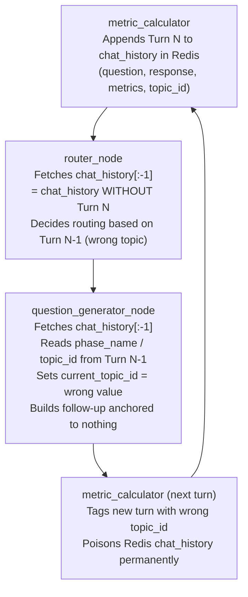

# Bug Fix Plan: Off-by-One Slice Deletes Candidate's Last Answer From Context

> [!IMPORTANT]
> **Status**: Confirmed — Root causes verified against live source files.

---

## 1. Why We Need To Fix This

This is the most consequential bug in the codebase. It does not degrade a feature — it **disables the entire adaptive interview engine**.

SkillIssue.ai's core value proposition over a static question bank is the feedback loop:

```
candidate answers → metrics scored → router evaluates quality → 
question generator anchors follow-up → candidate gets probed deeper
```

This loop is **driven by the candidate's last answer.** The router reads it to decide PROBE vs. INDEPENDENT. The question generator reads it to write a contextually grounded follow-up.

The `[:-k]` slice, when `k = 1` (which is the state for every first follow-up on every topic), strips that last answer out of the context window before either agent can see it.

**The result is not a degraded interview — it is a broken one:**

- The router makes routing decisions on the *previous* topic's turns. It cannot see what the candidate just said.
- The question generator writes "follow-up" questions that are not anchored to anything the candidate said. They are hallucinated.
- The phase/topic metadata extracted from the sliced history is stale, so `SystemState.current_topic_id` is written with a wrong value.
- Every subsequent turn in the session operates on corrupted state. The corruption is cumulative.
- The final report is built on mislabeled turns and invalid phase summaries.

**Every interview session in production is affected.** There is no code path through the same-topic branches that avoids the slice. This is not an edge case.

The fix is 9 lines across 2 files. The cost of not fixing it is an AI interview platform that cannot conduct an adaptive interview.

---

## 2. Bug Confirmation: Is the Report Correct?

**Yes. 100% confirmed.** After reading every relevant source file, the reported bug is real and precisely described.

### How `k` is set

`k = system_state.current_topic_question_count`. This counter is set to `1` the moment `question_generator` issues the first question on a new topic (lines 154/289 of `question_generator/agent.py`) and incremented by 1 for each dependent follow-up (line 218). It therefore equals the number of completed Q&A turns in the current topic block.

### What the slice does

```python
# router/agent.py — line 87
chat_history = session_state.get("chat_history", [])[:-k]

# question_generator/agent.py — line 44
chat_history = chat_histor_tot[:-k] if k and k > 0 else chat_histor_tot
```

When `k = 1`, `[:-1]` removes the last element — the turn that `metric_calculator` just wrote (the candidate's most recent answer with its metrics). This is the turn that both agents most need.



---

## 3. Root Cause Analysis

### Root Cause 1 — `[:-k]` is semantically inverted

The developer's intent, as documented by the comment in `question_generator/agent.py`, was:

> *"Strip the current-topic block so the LLM doesn't see questions it must not anchor to."*

This is a valid goal **only for the INDEPENDENT branch prompt**. The implementation applies the same slice to:
- The **router** (which must see the current-topic block to evaluate it)
- The **DEPENDENT branch** (which must see the current-topic block to anchor a follow-up)
- The **INDEPENDENT branch metadata extraction** (which reads `chat_history[-1].topic_id` to know which topic it's on)

The slice is in the right place for one narrow purpose and the wrong place for everything else.

### Root Cause 2 — `k = 1` is the universal first state

Because `current_topic_question_count` is initialised to `1` (not `0`) at topic start, `[:-1]` fires on the very first routing decision of every topic. There is no "warm-up" turn where the slice is harmless. Every topic, from the first follow-up onward, is affected.

### Root Cause 3 — No guard for the semantic inversion

The guard `if k and k > 0` only prevents `[:-0]` (which would return `[]`). It does nothing to detect that `k >= 1` is the common, harmful case. The guard is necessary but not sufficient.

---

## 4. Cascading Failures — Full Impact Map

| # | Failure | Agent(s) Affected | Severity |
|---|---|---|---|
| 1 | Router cannot see candidate's last answer; evaluates a different topic's metrics | `router` | Critical |
| 2 | Dependent follow-up is hallucinated; `previous_k_turns` is empty or stale | `question_generator` (DEPENDENT) | Critical |
| 3 | Independent branch reads `topic_id` / `phase_name` from stale turn; wrong topic targeted | `question_generator` (INDEPENDENT) | Critical |
| 4 | `SystemState.current_topic_id` written with wrong value; all downstream state is poisoned | `question_generator`, `metric_calculator` | Critical |
| 5 | Redis `chat_history` accumulates turns with wrong `topic_id` labels | `metric_calculator` | High |
| 6 | `phase_summarizer` summarises wrong question/answer against wrong phase | `phase_summarizer` | High |
| 7 | `report_generator` compiles report from corrupted phase summaries and mislabeled turns | `report_generator` | High |
| 8 | `get_next_topic` (TOPIC CHANGED branch) reads `chat_histor_tot[-1].topic_id` — if that is corrupted, the transition targets the wrong next topic | `question_generator` (TOPIC CHANGED) | High |

**Net effect:** Every interview session after the first question on the first topic is running on corrupted context. The adaptive interview engine does not function.

---

## 5. Why This Fix Over Alternatives

### Proposed Fix: Separate `chat_history_full` and `chat_history_pre_topic`

The conceptual insight is that two distinct slices serve two distinct purposes:

| Variable | Content | When to use |
|---|---|---|
| `chat_history_full` | All completed turns including current topic | Router decisions, metadata extraction, DEPENDENT context |
| `chat_history_pre_topic` | Turns *before* the current-topic block | INDEPENDENT prompt background only |

`k` already encodes the boundary. `chat_history_full[-k:]` is the current-topic block. `chat_history_full[:-k]` is the pre-topic background.

**Why this wins:**
- Minimal diff: 2 lines changed in router, ~7 lines changed in question_generator.
- Zero new abstractions, zero schema changes, zero new parameters.
- Preserves the original intent for the INDEPENDENT branch (not anchoring the LLM to current-topic turns) while restoring correctness everywhere else.
- No downstream changes: `metric_calculator`, `phase_summarizer`, `orchestrator`, and Redis are untouched.

### Alternative A: Change `k` to 0-indexed (start at 0, not 1)

Initialise `current_topic_question_count = 0` and increment before issuing a question. Then `[:-k]` with `k = 0` would return the full list.

**Why this loses:** `list[:-0]` in Python is `[]`, not `list`. The guard `if k` would need to change to `if k > 0`, and `else` would return the full list. This creates a new guard pattern in every consumer of `k`. The semantic meaning of the counter changes silently — existing log messages and assertions break. Trades one off-by-one for another with wider blast radius.

### Alternative B: Redis schema restructuring (store history keyed by topic)

Store `chat_history` as a dict keyed by `topic_id` so agents can fetch exactly the turns they need without slicing.

**Why this loses:** Requires changes to `metric_calculator` (writer), `phase_summarizer` (reader), `session_store.update` call sites, and a migration of any existing Redis sessions. The blast radius is 5+ files and a data migration. The bug is a 9-line fix; this is a multi-day refactor.

### Alternative C: Router filters by `topic_id` in Python

Have the router filter `chat_history` by `current_topic_id` rather than slicing.

**Why this loses:** Only fixes the router. The `question_generator` metadata extraction (lines 233–234) and dependent branch still read from the wrong slice. Requires a partial fix anyway. The proposed fix is strictly simpler and complete.

---

## 6. The Fix

### 6.1 Files to Change

| File | Lines | Change |
|---|---|---|
| [`src/agents/router/agent.py`](file:///Users/sufi_spryzen/Knowledge%20Base/Dev_Workspace/Projects/SkillIssue/SkillIssue.ai/src/agents/router/agent.py) | 87–88 | Remove `[:-k]`; pass full parsed history to router prompt |
| [`src/agents/question_generator/agent.py`](file:///Users/sufi_spryzen/Knowledge%20Base/Dev_Workspace/Projects/SkillIssue/SkillIssue.ai/src/agents/question_generator/agent.py) | 40–46, 64–65, 170, 179, 233–234, 248 | Rename variables; use `[-k:]` for DEPENDENT; use `[:-k]` only for INDEPENDENT prompt |

> [!NOTE]
> No changes needed to `router/prompt.py`, `states.py`, `redis_session.py`, `metric_calculator`, `phase_summarizer`, or any other file.

---

### 6.2 Step 1 — Fix `router/agent.py`

**File**: [`src/agents/router/agent.py` L86–88](file:///Users/sufi_spryzen/Knowledge%20Base/Dev_Workspace/Projects/SkillIssue/SkillIssue.ai/src/agents/router/agent.py#L86-L88)

The router prompt already instructs the LLM to *"focus on the most recent contiguous block of turns with the same `topic_id`"*. No Python pre-filtering is needed — pass the full history and let the LLM filter semantically.

```diff
     ## Same Topic
     session_state = session_store.get(session_id)
-    chat_history = session_state.get("chat_history", [])[:-k]
-    chat_history = parse_chat_history(chat_history)
+    raw_history = session_state.get("chat_history", [])
+    chat_history = parse_chat_history(raw_history)
     log_agent_event(
```

---

### 6.3 Step 2 — Fix `question_generator/agent.py`

**File**: [`src/agents/question_generator/agent.py`](file:///Users/sufi_spryzen/Knowledge%20Base/Dev_Workspace/Projects/SkillIssue/SkillIssue.ai/src/agents/question_generator/agent.py)

#### Step 2a — Rename and separate the two slices (lines 40–46)

```diff
     phase_summary = session_state.get("phase_summary", [])
     raw_history = session_state.get("chat_history") or []
-    chat_histor_tot = parse_chat_history(raw_history)
-    # For DEPENDENT / same-topic INDEPENDENT branches: strip the current-topic block
-    # so the LLM doesn't see questions it must not anchor to.
-    chat_history = chat_histor_tot[:-k] if k and k > 0 else chat_histor_tot
-    # For TOPIC CHANGED: preserve the very last turn so the LLM can bridge from it.
-    last_turn = chat_histor_tot[-1] if chat_histor_tot else None
+    chat_history_full = parse_chat_history(raw_history)
+    # Pre-topic background: turns *before* the current-topic block.
+    # Used only as background context for the INDEPENDENT branch prompt,
+    # so the LLM does not accidentally anchor its question to current-topic turns.
+    chat_history_pre_topic = chat_history_full[:-k] if k > 0 else chat_history_full
+    # last_turn: used as bridge context for TOPIC CHANGED transition.
+    last_turn = chat_history_full[-1] if chat_history_full else None
```

#### Step 2b — Fix TOPIC CHANGED branch metadata reads (lines 63–65)

```diff
-        if chat_histor_tot:
-            prev_phase = chat_histor_tot[-1].phase_name
-            prev_topic_id = chat_histor_tot[-1].topic_id
+        if chat_history_full:
+            prev_phase = chat_history_full[-1].phase_name
+            prev_topic_id = chat_history_full[-1].topic_id
```

#### Step 2c — Fix DEPENDENT branch (lines 170, 179)

The DEPENDENT branch must anchor to what the candidate actually said in the current topic. Pass the current-topic block (`[-k:]`), not the pre-topic background.

```diff
-        current_phase_name = chat_history[-1].phase_name
+        current_phase_name = chat_history_full[-1].phase_name
         current_phase = get_current_phase(plan, current_phase_name)
         ...
         messages = dependent_question_prompt(
             current_phase_summary=current_phase_summary,
-            previous_k_turns=chat_history,
+            previous_k_turns=chat_history_full[-k:],
             user_summary=user_summary,
             jd=jd,
             phase=current_phase,
             router_reason=reason,
         )
```

#### Step 2d — Fix INDEPENDENT branch metadata and prompt (lines 233–234, 248)

Metadata must come from the full history (so we read the correct current topic). The prompt receives only the pre-topic background (preserving original intent).

```diff
-    current_phase_name = chat_history[-1].phase_name
-    current_topic_id = chat_history[-1].topic_id
+    current_phase_name = chat_history_full[-1].phase_name
+    current_topic_id = chat_history_full[-1].topic_id

     topic = get_current_topic(plan, current_phase_name, current_topic_id)
     ...
     messages = independent_question_prompt(
         previous_phase_summaries=phase_summary,
         user_summary=user_summary,
-        previous_k_turns=chat_history,
+        previous_k_turns=chat_history_pre_topic,
         jd=jd,
         phase=current_phase,
         topic=topic,
         router_reason=reason,
     )
```

---

## 7. Validation

After applying the fix, run:

```bash
# 1. Verify the graph still compiles (catches any import/config regressions)
python -c "from src.agents.orchestrator import _build_graph; _build_graph(); print('Graph OK')"

# 2. Run backend tests
pytest src/tests/ -v --cov=src --cov-report=term-missing
```

**What to verify in MongoDB logs after the fix:**

- `router / session_store_loaded` events: `chat_history` field should now include Turn N (the most recent turn).
- `question_generator / context_prepared` events: `chat_history` (passed to DEPENDENT prompt) should now be `[-k:]` — the current-topic block. `chat_history_pre_topic` (passed to INDEPENDENT prompt) should be the pre-topic background.
- Follow-up questions should be visibly grounded in what the candidate actually said in their last answer.
- `system_state.current_topic_id` after the node should match the topic the candidate was just questioned on — not a stale previous topic.

---

## 8. Risk Assessment

| Risk | Severity | Mitigation |
|---|---|---|
| Passing full history to router increases prompt token count | Low | The router already received full history before this slice was introduced. The difference is at most `k` turns (typically 1–3). Negligible. |
| INDEPENDENT prompt now receives `chat_history_pre_topic` (may be empty on first topic) | Low | If `chat_history_pre_topic` is empty (first topic, no prior background), the prompt gracefully receives an empty list — same as before the bug was introduced. |
| DEPENDENT branch now receives `chat_history_full[-k:]` — the current-topic block only | None | This is precisely what the DEPENDENT branch prompt expects ("anchor to prior context"). It is strictly more correct than what it was receiving. |
| Rename of `chat_histor_tot` (note: original had a typo) | None | The rename to `chat_history_full` fixes a pre-existing typo and improves readability with zero behaviour change. |
