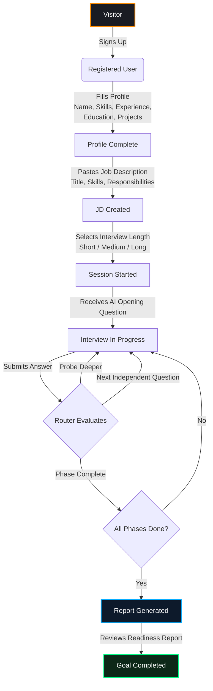
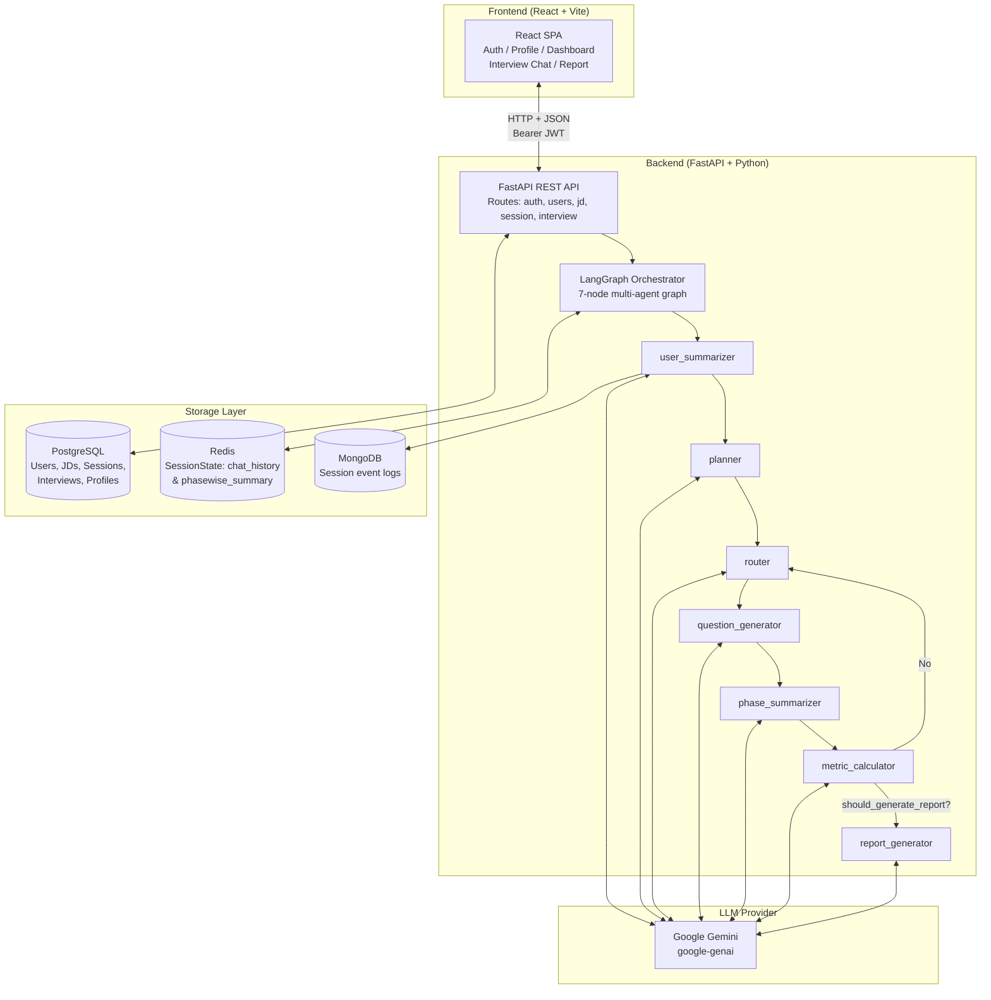

# Product Requirements Document: SkillIssue.ai

> [!NOTE]
> This PRD acts as the source of truth for the product requirements, engineering design, and implementation plan. It is designed to maximize the performance of agentic AI workflows.

---

## 1. Executive Summary

### Overview
SkillIssue.ai is an AI-powered mock interviewer platform that conducts adaptive, context-aware interview sessions tailored to a specific candidate's profile (Resume/CV) and a target Job Description (JD). The platform bridges the critical gap between generic interview prep tools and real-world, role-specific evaluation — enabling candidates to understand exactly where they stand before walking into an actual interview.

The system leverages a multi-agent LangGraph orchestration framework to dynamically plan, execute, and evaluate interviews. It generates contextually grounded questions by synthesizing the candidate's claimed skills against the employer's required competencies, then evaluates responses across 8 specialized performance metrics, finally producing a markdown "Interview Readiness Report."

The platform serves two user groups: job-seekers seeking realistic technical and behavioral preparation, and ultimately organizations seeking a proctored remote assessment tool.

### Value Proposition
- **Context-First Questioning**: Questions are not drawn from generic banks — they are synthesized live from the intersection of the candidate's experience and the job's demands.
- **Objective Multi-Dimensional Scoring**: Eight distinct metrics (QAR, TDS, ACS, SS, CCS, FARQ, RFD, STAR) eliminate interviewer subjectivity and give candidates a structured lens on their performance.
- **Actionable Reporting**: The final report identifies technical gaps, relevance gaps, and resume-vs-demonstrated-knowledge discrepancies with a concrete hiring recommendation.

### MVP Success Statement
The MVP must enable a registered user to upload their profile, paste a Job Description, start an AI-driven interview session that dynamically generates contextual questions, submit answers turn-by-turn, and receive a final scored Interview Readiness Report.

---

## 2. Product Mission & Principles

- **Context over Generic**: Every question must be derived from the specific candidate–JD intersection. Generic questions that could apply to any candidate are a failure state.
- **Adaptive Flow**: The interview must respond dynamically — probing deeper when answers are vague, pivoting when a topic is exhausted, and escalating to a report when all phases are covered.
- **Transparent Scoring**: All evaluation dimensions must be surfaced to the user with explanations, not just a single opaque score.
- **Minimal Latency**: The round-trip from submitting an answer to receiving the next question must feel conversational. Redis-backed state management is the mechanism to achieve this.
- **Progressive Enhancement**: The platform is architected in phases — Phase I (Core Text MVP) is fully functional standalone; Phases II–IV (Voice, Proctoring, Behavioral Analysis) are additive extensions that do not require Phase I to be modified.

---

## 3. User Journey Map

---

## 4. MVP Scope Definition

| System Module | In Scope (✅) | Out of Scope (❌) |
|---|---|---|
| **Identity & Access** | Email/Password auth, JWT tokens, session management, logout/token revocation | OAuth (Google/GitHub), MFA, SSO |
| **Candidate Profile** | Full structured profile (basics, experience, education, projects, leadership), profile editing | Resume PDF parsing (auto-extraction from uploaded file) |
| **Job Description** | Manual JD entry (title, required skills, responsibilities), multi-JD per user | Automatic JD scraping from URLs |
| **Interview Engine** | Multi-agent LangGraph orchestration, context-aware question generation, 3-case routing (probe/independent/next topic), turn-by-turn answer submission | Concurrent sessions per user, batch interview export |
| **Scoring** | 8-metric per-turn evaluation (QAR, TDS, ACS, SS, CCS, FARQ, RFD, STAR) | Real-time metric display during interview |
| **Reporting** | Markdown Interview Readiness Report with strengths, gaps, and hiring recommendation | PDF export (frontend print media query exists), email delivery |
| **User Interface** | React (Vite) web app — Auth, Profile, Dashboard, Interview Setup, Chat Canvas, Report view | Native mobile app, browser extension |
| **Voice Interface** | — | STT/TTS, real-time audio streaming (Phase II) |
| **Proctoring** | — | Webcam monitoring, tab-switch detection, multi-voice detection (Phase III) |
| **Behavioral Analysis** | — | Micro-expression analysis, audio sentiment scoring (Phase IV) |

---

## 5. Functional Specifications & User Stories

### 5.1 Authentication
1. **As a** visitor, **I want to** sign up with email, username, and password, **so that** I can save my profile and interview history.
   - *Acceptance Criteria*: Argon2-hashed password, unique email validation, JWT returned on success.
2. **As a** user, **I want to** log in and have my session persist, **so that** I don't have to re-authenticate on every visit.
   - *Acceptance Criteria*: JWT token stored on client, token revocation on logout via `TokenModel` blacklist table.

### 5.2 Profile Management
3. **As a** user, **I want to** fill in my professional profile (experiences, education, projects, leadership roles), **so that** the AI has the context it needs to interview me properly.
   - *Acceptance Criteria*: Dynamic form with add/remove for array fields; pre-fills from existing DB record.

### 5.3 Job Description
4. **As a** user, **I want to** create a Job Description entry with title, required skills, and responsibilities, **so that** the AI can target the interview to my specific role.
   - *Acceptance Criteria*: JD linked to `user_id`, retrievable for session start.

### 5.4 Interview Session
5. **As a** user, **I want to** start an interview session by selecting a JD and interview length, **so that** the AI can begin the tailored session immediately.
   - *Acceptance Criteria*: Session created in DB, `SystemState` initialized, opening question returned in response.
6. **As a** user, **I want to** submit my answer and immediately receive the next AI question, **so that** the interview feels like a live conversation.
   - *Acceptance Criteria*: `submit_answer` resumes the LangGraph, processes through router → question generator → phase summarizer → metric calculator, returns next question with current phase/topic metadata.
7. **As a** user, **I want to** see the current phase and topic during the interview, **so that** I know where I am in the evaluation.
   - *Acceptance Criteria*: Response payload includes `current_phase_name` and `current_topic_name`.

### 5.5 Report
8. **As a** user, **I want to** receive a comprehensive Interview Readiness Report after my session ends, **so that** I know exactly what to improve.
   - *Acceptance Criteria*: Report rendered via `react-markdown`, includes executive summary, metric breakdown, key strengths, improvement areas, and a final hiring recommendation.

---

## 6. System Architecture & Tech Stack

### Tech Stack Table

| Component | Technology | Version | Purpose |
|---|---|---|---|
| **Backend Runtime** | Python | 3.10+ | Async-capable runtime for FastAPI + LangGraph |
| **API Framework** | FastAPI | 0.128.2 | Type-safe async REST API, OpenAPI docs at `/docs` |
| **Agent Framework** | LangGraph | 1.0.4 | Stateful multi-agent graph with interrupt/resume support |
| **LLM SDK** | langchain-google-genai | 4.2.0 | Google Gemini model access |
| **SQL ORM** | SQLAlchemy (async) | ≥1.4 | Async ORM for PostgreSQL — Users, JDs, Sessions |
| **Migrations** | Alembic | 1.18.3 | Schema migration management |
| **NoSQL DB** | MongoDB (Motor) | 3.7.1 | Agent event logging for audit/debugging |
| **Cache / Session** | Redis | ≥5.0.1 | Heavy session state: `chat_history`, `phasewise_summary` |
| **Auth** | Argon2 + JWT | passlib 1.7.4 | Password hashing + stateless Bearer token auth |
| **Frontend Framework** | React (Vite) | Latest | SPA for interview UI |
| **Frontend Routing** | react-router-dom | Latest | Client-side routing |
| **Frontend Rendering** | react-markdown | Latest | Render AI-generated report markdown |
| **Gradio UI** | Gradio | 6.5.1 | Alternative dev/demo interface at port 7860 |
| **ASGI Server** | Uvicorn | 0.40.0 | Production-grade ASGI server |

---

## 7. Security & Configuration

- **Authentication**: JWT Bearer tokens (HS256 signed). Token revocation via DB blacklist (`TokenModel`).
- **Password Hashing**: Argon2 (via `argon2_cffi` + `passlib`).
- **CORS**: Strict allow-list — only `http://localhost:5173` in dev.
- **Environment Variables** (`.env`, never commit to git):

| Variable | Description |
|---|---|
| `DATABASE_URL` | Async PostgreSQL connection string (`postgresql+asyncpg://...`) |
| `REDIS_URL` | Redis connection string (`redis://localhost:6379`) |
| `ATLAS_DB_URI` | MongoDB Atlas URI for event logging |
| `MONGO_DB` | MongoDB database name |
| `COLLECTION_NAME` | MongoDB collection name for logs |
| `GOOGLE_API_KEY` | Google Gemini API key |
| `GROQ_API_KEY` | Groq API key (optional alternative LLM) |
| `MODEL` | LLM model name string (e.g. `gemini-2.0-flash`) |
| `SECRET_KEY` | JWT signing secret |
| `ALGORITHM` | JWT algorithm (e.g. `HS256`) |
| `ACCESS_TOKEN_EXPIRY_MINUTES` | Token lifetime |
| `JWT_API_KEY` | Internal API key for service-to-service auth |

---

## 8. Success Criteria & Metrics

- [ ] **Session Start**: User can start a session and receive an opening question in < 10 seconds.
- [ ] **Turn Latency**: Each answer-to-next-question round-trip completes in < 15 seconds (LLM-bound).
- [ ] **Routing Accuracy**: Router correctly classifies probe/independent/topic-change cases per the `current_turn_status` field.
- [ ] **Report Generation**: Final report is generated and returned via `GET /api/v1/session/{session_id}/report` after session conclusion.
- [ ] **Zero Auth Regressions**: Login, signup, and logout flows work without console errors.
- [ ] **Profile Persistence**: User profile data round-trips correctly (write to DB → read back → pre-fill form).
- [ ] **Frontend Stability**: No unhandled React exceptions during normal interview flow (Setup → Chat → Report).

---

## 9. Phased Implementation Roadmap

### Phase 1: Foundation ✅ (Complete)
- **Goal**: Backend skeleton, auth, profile/JD CRUD, DB layer.
- [x] FastAPI app with CORS, middleware, router registration.
- [x] SQLAlchemy async engine + Alembic migrations.
- [x] Auth routes: `/api/v1/auth/signup`, `/login`, `/logout`.
- [x] User profile routes: GET/PUT `/api/v1/users/{user_id}`.
- [x] JD routes: POST/GET `/api/v1/jd`.
- [x] Pydantic models, schemas, and settings.

### Phase 2: Core Agent Engine ✅ (Complete)
- **Goal**: Build and wire all 7 LangGraph agent nodes.
- [x] `user_summarizer` — summarizes candidate profile.
- [x] `planner` — generates phase/topic interview plan from User Summary + JD.
- [x] `router` — 3-case routing logic (probe / independent / next topic).
- [x] `question_generator` — crafts questions for each routing case.
- [x] `phase_summarizer` — rolling summary per phase; preserves previous phase on transition.
- [x] `metric_calculator` — scores 8 metrics per turn.
- [x] `report_generator` — compiles final Markdown readiness report.
- [x] LangGraph graph compiled with `interrupt_before=[phase_summarizer]` for UI interaction.

### Phase 3: Session API ✅ (Complete)
- **Goal**: Wire the agent graph to REST endpoints.
- [x] `GET /api/v1/session/user/{user_id}/jd/{jd_id}/length/{interview_length}` — starts session, returns opening question.
- [x] `POST /api/v1/session/{session_id}/answer` — submits answer, resumes graph, returns next question.
- [x] `GET /api/v1/session/{session_id}/report` — fetches final report.
- [x] Dual-state architecture: `SystemState` (Pydantic, in-graph) + `SessionState` (Redis, persistent).

### Phase 4: Frontend MVP ✅ (Complete)
- **Goal**: React SPA integrated with all backend endpoints.
- [x] Auth pages: Login, Signup.
- [x] Profile page with dynamic array forms (Experience, Education, Projects, Leadership).
- [x] Dashboard with "New Interview" CTA.
- [x] Interview Setup (`/interview/start`) — JD input form → session start.
- [x] Interview Session (`/interview/:session_id`) — two-column layout: sidebar (phase/topic tracker) + chat canvas.
- [x] Report page (`/report/:session_id`) — react-markdown rendered readiness report.

### Phase 5: Voice Interface 🔲 (Planned — Phase II)
- **Goal**: Replace text chat with spoken conversation.
- [ ] Integrate STT (Whisper or equivalent) for real-time transcription.
- [ ] Integrate TTS for AI question playback.
- [ ] Handle filler words, pauses, and audio interruptions.
- [ ] Minimize dead-air latency between answer end and next question.

### Phase 6: Proctoring Layer 🔲 (Planned — Phase III)
- **Goal**: Monitor interview integrity.
- [ ] Webcam feed analysis for presence/gaze detection.
- [ ] Tab-switch and copy-paste event detection.
- [ ] Multi-voice detection in audio stream.

### Phase 7: Behavioral Analyst 🔲 (Planned — Phase IV)
- **Goal**: Affective computing layer for soft-skill evaluation.
- [ ] Micro-expression analysis via facial landmark tracking.
- [ ] Audio sentiment and delivery analysis.
- [ ] Correlate physical behavior with answer quality metrics.

---

## 10. Risks & Mitigation

| Risk | Severity | Mitigation Strategy |
|---|---|---|
| LLM latency spikes (Gemini API) | High | Cache user summaries and plans; only LLM-call the incremental nodes per turn. |
| Redis session loss on restart | Medium | Set appropriate TTLs; implement DB-backed session recovery fallback. |
| LangGraph state inconsistency on interrupt | Medium | `MemorySaver` checkpointer persists graph state across interrupt/resume cycles — validate checkpoint integrity on startup. |
| JWT token replay after logout | Medium | Token blacklist in `token_model.py` DB table; validate against blacklist on every protected route. |
| MongoDB log collection growing unbounded | Low | Implement TTL index on the `session_logging` collection. |
| Planner generating too few/many topics | Medium | `min_topics` / `max_topics` fields in `SystemState` constrain the plan; validated at plan generation time. |
