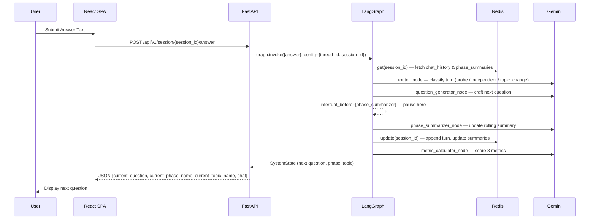
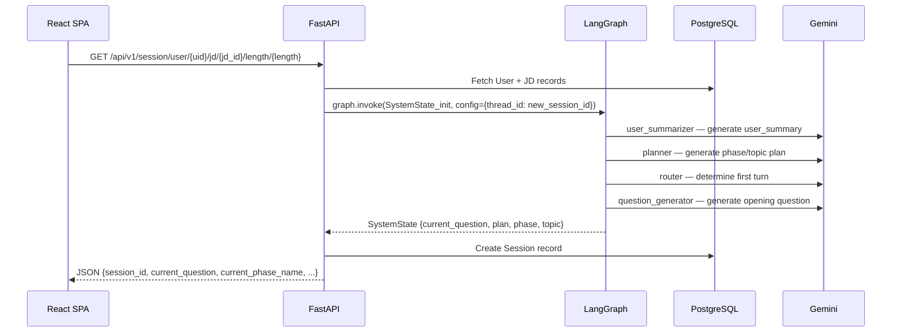
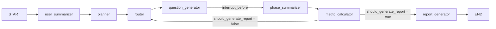

# System Architecture Specification: SkillIssue.ai

This document details the architectural layers, data flows, and design decisions of the system.

---

## 1. Project Structure

```text
SkillIssue.ai/
├── src/                          # Python FastAPI backend
│   ├── main.py                   # FastAPI application entry point, CORS, router registration
│   ├── gradio.py                 # Alternative Gradio UI (dev/demo — port 7860)
│   ├── config.py                 # Pydantic Settings — reads from .env
│   ├── database.py               # SQLAlchemy async engine + MongoDB (Motor) client
│   ├── agents/                   # LangGraph multi-agent orchestration
│   │   ├── orchestrator.py       # Graph builder: nodes, edges, conditional routing
│   │   ├── llm.py                # LLM client initialisation (Google Gemini)
│   │   ├── session_logging.py    # MongoDB agent event logger
│   │   ├── agent_utils/          # Shared agent utilities
│   │   ├── user_summarizer/      # Agent: summarizes candidate profile
│   │   ├── planner/              # Agent: generates phase/topic interview plan
│   │   ├── router/               # Agent: 3-case routing decision
│   │   ├── question_generator/   # Agent: crafts contextual questions
│   │   ├── phase_summarizer/     # Agent: rolling phase summaries
│   │   ├── metric_calculator/    # Agent: scores 8 metrics per turn
│   │   └── report_generator/     # Agent: compiles final Markdown report
│   ├── controllers/              # Business logic — called by route handlers
│   │   ├── auth/                 # signup, login, logout controllers
│   │   ├── session/              # start_session, submit_answer, create_report
│   │   └── ...
│   ├── routes/                   # FastAPI router definitions
│   │   ├── routes_auth.py        # /api/v1/auth/*
│   │   ├── routes_user.py        # /api/v1/users/*
│   │   ├── routes_jd.py          # /api/v1/jd/*
│   │   ├── routes_session.py     # /api/v1/session/*
│   │   ├── routes_interview.py   # /api/v1/interview/*
│   │   └── routes_health_check.py
│   ├── models/                   # SQLAlchemy ORM models
│   │   ├── user_model.py
│   │   ├── jd_model.py
│   │   ├── interview_model.py
│   │   ├── plan_model.py
│   │   ├── experience_model.py
│   │   ├── education_model.py
│   │   ├── project_model.py
│   │   ├── leadership_model.py
│   │   ├── token_model.py
│   │   └── states/               # In-session state models
│   │       ├── states.py         # SystemState (Pydantic), SessionState (Pydantic)
│   │       ├── redis_session.py  # RedisSessionStore — get/set/update
│   │       ├── state_init.py     # State factory / initializer
│   │       ├── turn.py           # Turn model (question, answer, metrics)
│   │       ├── phase_summary.py  # PhaseSummary model
│   │       └── metrics.py        # Metrics model (8 dimensions)
│   └── schemas/                  # Pydantic request/response schemas
├── frontend/                     # React + Vite SPA
│   ├── src/
│   │   ├── App.jsx               # Root: router config + AppLayout wrapper
│   │   ├── main.jsx              # React DOM mount
│   │   ├── index.css             # Global design tokens (Jost typography, Minimalist White)
│   │   ├── pages/
│   │   │   ├── auth/             # Login.jsx, Signup.jsx
│   │   │   ├── dashboard/        # Dashboard.jsx
│   │   │   ├── profile/          # Profile.jsx (new + edit)
│   │   │   └── interview/        # SetupInterview.jsx, InterviewSession.jsx, Report.jsx
│   │   ├── components/
│   │   │   ├── layout/           # Navbar.jsx, AppLayout
│   │   │   └── ui/               # Input.jsx, Button.jsx, Card.jsx
│   │   ├── context/              # AuthContext.jsx — global token/user state
│   │   ├── services/             # api.js — all Axios/fetch calls to FastAPI
│   │   └── lib/                  # Shared utilities
│   ├── index.html                # Jost font import, root mount
│   └── vite.config.js
├── reference/                    # Architecture, API, DB, Testing docs (this folder)
├── logs/                         # Runtime logs
├── PRD.md                        # Product Requirements Document
├── ProblemStatement.md           # Original problem definition
├── implementation_log.md         # Chronological build log
├── requirements.txt              # Python dependencies
└── .env                          # Environment variables (never commit)
```

---

## 2. Core Architectural Components

- **FastAPI API Layer**: Handles HTTP requests, JWT authentication validation, CORS, and dispatches to controllers. All routes are prefixed under `/api/v1/`.
- **Controller Layer**: Business logic per feature domain (auth, session, user, JD). Controllers are called by routes and call into agents/DB.
- **LangGraph Orchestration Layer**: The interview engine. A `StateGraph` of 7 specialized agent nodes with a `MemorySaver` checkpointer. The graph is compiled once at startup and reused across sessions via `thread_id = session_id`.
- **SQLAlchemy Data Layer**: Async PostgreSQL ORM for persistent relational data — Users, JobDescriptions, Sessions, Interviews, Profiles (Experience, Education, Projects, Leadership), Tokens.
- **Redis Session Layer**: Stores the heavy, rapidly-mutating session data (`chat_history`, `phasewise_summary`) separately from the graph state to avoid polluting the LangGraph checkpointer. Accessed via `RedisSessionStore`.
- **MongoDB Log Layer**: Append-only event log for all agent invocations (via `session_logging.py`). Used for debugging, audit trails, and future analytics.
- **LLM Layer**: Google Gemini accessed via `langchain-google-genai`. All 7 agents share the same `llm` client instance.

---

## 3. Dual-State Architecture

The system deliberately splits session state into two stores to balance performance and storage needs:

| State Object | Store | Contents | Rationale |
|---|---|---|---|
| `SystemState` (Pydantic) | LangGraph `MemorySaver` (in-process) | `user`, `jd`, `user_summary`, `plan`, `current_question`, `current_topic_id`, `current_phase_name`, `current_turn_status`, `should_generate_report` | Lightweight; propagated through every graph node at high speed. |
| `SessionState` (Pydantic → Redis) | Redis | `chat_history` (all turns), `phasewise_summary` (all phase summaries) | Heavy, append-only. Redis ensures fast async retrieval without bloating the LangGraph checkpointer. |

---

## 4. Core Data Flow

### Interview Turn Cycle



### Session Start Flow



---

## 5. LangGraph Agent Graph



**Interrupt Mechanism**: The graph is compiled with `interrupt_before=[phase_summarizer]`. This means after `question_generator` produces a question, the graph pauses. The FastAPI route returns the question to the frontend. On the next `submit_answer` call, the graph resumes from `phase_summarizer` with the user's answer injected into state.

---

## 6. Key Architectural Patterns

### Human-in-the-Loop (HITL) via LangGraph Interrupt
- **Mechanism**: `interrupt_before=[phase_summarizer]` halts graph execution after `question_generator`. FastAPI returns the pending question to the frontend. On `POST /answer`, the graph resumes using `MemorySaver` checkpoint keyed by `thread_id=session_id`.
- **Purpose**: Converts a single linear agent pipeline into an interactive, turn-by-turn conversation without re-running upstream nodes.

### Dual-State Split (Pydantic + Redis)
- **Mechanism**: Lightweight ephemeral fields in `SystemState` (LangGraph); heavy append-only fields in `SessionState` (Redis). The Redis store is accessed inside agent nodes via `session_store.get/update`.
- **Purpose**: Avoids serializing large `chat_history` lists into every LangGraph checkpoint, keeping the checkpointer lean and fast.

### 3-Case Router
- **Mechanism**: `router_node` reads `current_turn_status`, `chat_history`, and `phasewise_summary` and classifies the next step as one of: `PROBE` (dependent follow-up), `INDEPENDENT` (same-topic new angle), or `TOPIC_CHANGE`.
- **Purpose**: Simulates a skilled human interviewer who knows when to dig deeper vs. move on.

### Token Blacklist Logout
- **Mechanism**: On logout, the JWT is inserted into `token_model` (PostgreSQL). All protected routes check the token against this blacklist.
- **Purpose**: Enables true stateless JWT auth with the ability to revoke tokens without switching to session-based auth.
