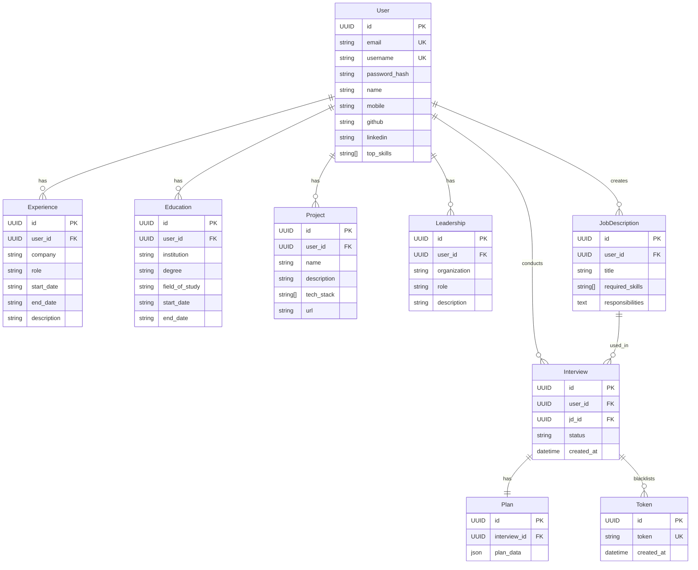

# Database Schema & Data Models Specification: SkillIssue.ai

This document details the database schema, models, relational mappings, and storage layer architecture.

---

## 1. Storage Layer Overview

SkillIssue.ai uses a **polyglot persistence** strategy with three distinct stores:

| Store | Technology | Purpose |
|---|---|---|
| **PostgreSQL** | SQLAlchemy (async) + Alembic | Relational persistent data — users, profiles, JDs, sessions, tokens |
| **Redis** | `redis-py` | High-speed session state — `chat_history` and `phasewise_summary` per session |
| **MongoDB** | Motor (async) | Append-only agent event logs for audit trails and debugging |

---

## 2. Entity-Relationship Diagram (ERD)



---

## 3. Model Definitions

### `User` (`user_model.py`)
| Field | Type | Constraints | Notes |
|---|---|---|---|
| `id` | UUID | PK, auto-generated | |
| `email` | String | Unique, Not Null | Validated via `pydantic[email]` |
| `username` | String | Unique, Not Null | |
| `password` | String | Not Null | Argon2-hashed (never stored plain) |
| `name` | String | Nullable | Display name |
| `mobile` | String | Nullable | |
| `github` | String | Nullable | |
| `linkedin` | String | Nullable | |
| `top_skills` | JSON/Array | Nullable | List of skill strings |

**Relationships**: One-to-Many with `Experience`, `Education`, `Project`, `Leadership`, `JobDescription`, `Interview`.

---

### `Experience` (`experience_model.py`)
| Field | Type | Constraints |
|---|---|---|
| `id` | UUID | PK |
| `user_id` | UUID | FK → `User.id`, Not Null |
| `company` | String | Not Null |
| `role` | String | Not Null |
| `start_date` | String | Not Null |
| `end_date` | String | Nullable |
| `description` | Text | Nullable |

---

### `Education` (`education_model.py`)
| Field | Type | Constraints |
|---|---|---|
| `id` | UUID | PK |
| `user_id` | UUID | FK → `User.id`, Not Null |
| `institution` | String | Not Null |
| `degree` | String | Not Null |
| `field_of_study` | String | Nullable |
| `start_date` | String | Nullable |
| `end_date` | String | Nullable |

---

### `Project` (`project_model.py`)
| Field | Type | Constraints |
|---|---|---|
| `id` | UUID | PK |
| `user_id` | UUID | FK → `User.id`, Not Null |
| `name` | String | Not Null |
| `description` | Text | Nullable |
| `tech_stack` | JSON/Array | Nullable |
| `url` | String | Nullable |

---

### `Leadership` (`leadership_model.py`)
| Field | Type | Constraints |
|---|---|---|
| `id` | UUID | PK |
| `user_id` | UUID | FK → `User.id`, Not Null |
| `organization` | String | Not Null |
| `role` | String | Not Null |
| `description` | Text | Nullable |

---

### `JobDescription` (`jd_model.py`)
| Field | Type | Constraints |
|---|---|---|
| `id` | UUID | PK |
| `user_id` | UUID | FK → `User.id`, Not Null |
| `title` | String | Not Null |
| `required_skills` | JSON/Array | Not Null |
| `responsibilities` | Text | Not Null |

---

### `Interview` (`interview_model.py`)
| Field | Type | Constraints |
|---|---|---|
| `id` | UUID | PK (also serves as `session_id`) |
| `user_id` | UUID | FK → `User.id`, Not Null |
| `jd_id` | UUID | FK → `JobDescription.id`, Not Null |
| `status` | String | e.g. `"in_progress"`, `"completed"` |
| `created_at` | DateTime | Auto-set on creation |

---

### `Plan` (`plan_model.py`)
| Field | Type | Constraints |
|---|---|---|
| `id` | UUID | PK |
| `interview_id` | UUID | FK → `Interview.id`, Not Null |
| `plan_data` | JSON | The full hierarchical plan (phases → topics) |

---

### `Token` (`token_model.py`)
Blacklist table for revoked JWT tokens.

| Field | Type | Constraints |
|---|---|---|
| `id` | UUID | PK |
| `token` | String | Unique, Not Null |
| `created_at` | DateTime | Auto-set on creation |

> [!IMPORTANT]
> Every authenticated route must check the incoming JWT against this table. If the token exists here, the request must be rejected with HTTP 401.

---

## 4. In-Memory & Redis State Models

### `SystemState` (Pydantic — LangGraph in-process)
Propagated through every agent node in the LangGraph graph. Stored in `MemorySaver` keyed by `thread_id = session_id`.

| Field | Type | Description |
|---|---|---|
| `session_id` | str | UUID string of the active interview |
| `user` | User | Full user Pydantic model |
| `user_summary` | str | LLM-generated narrative of the candidate |
| `jd` | JobDescription | Full JD Pydantic model |
| `current_question` | str | The most recently generated question |
| `is_curr_question_independent` | bool | Whether the current question is topic-independent |
| `current_response` | str | The candidate's most recent answer |
| `plan` | Plan | The full hierarchical interview plan |
| `current_topic_id` | str | ID of the active topic |
| `current_topic_question_count` | int | Questions asked on the current topic |
| `current_phase_name` | str | Name of the active phase |
| `current_turn_status` | str | Router output: `PROBE` / `INDEPENDENT` / `TOPIC_CHANGE` |
| `min_topics` | int | Minimum topics per phase (from interview_length) |
| `max_topics` | int | Maximum topics per phase |
| `final_report` | str | Populated by `report_generator` |
| `should_generate_report` | bool | Flag set when interview is complete |

---

### `SessionState` (Pydantic — Redis-backed)
Heavy session data stored in Redis under key `session:{session_id}`.

| Field | Type | Description |
|---|---|---|
| `session_id` | str | UUID string |
| `chat_history` | List[Turn] | Full list of all question/answer/metrics turns |
| `phasewise_summary` | List[PhaseSummary] | Rolling LLM summary per completed phase |

### `Turn` Model
```python
class Turn:
    question: str
    answer: str
    metrics: Metrics  # 8 float fields: QAR, TDS, ACS, SS, CCS, FARQ, RFD, STAR
```

### `PhaseSummary` Model
```python
class PhaseSummary:
    phase_name: str
    summary: str   # LLM-generated rolling summary for the phase
```

---

## 5. MongoDB Schema (Agent Event Logs)

Collection: `COLLECTION_NAME` (configured via `.env`)

Each document is an agent event log entry written by `session_logging.py`:

```json
{
  "_id": "ObjectId",
  "session_id": "session-uuid",
  "agent": "router",
  "event": "route_after_metrics",
  "timestamp": "2026-06-05T10:00:00Z",
  "data": {
    "should_generate_report": false,
    "current_turn_status": "PROBE",
    "current_topic_id": "topic-uuid",
    "current_phase_name": "Technical"
  }
}
```

> [!TIP]
> Add a TTL index on `timestamp` to automatically expire old logs and control collection growth:
> `db.logs.createIndex({ "timestamp": 1 }, { expireAfterSeconds: 2592000 })` (30 days)

---

## 6. Database Indexes & Performance Optimizations

### PostgreSQL
1. **User Email Index** — High-speed login lookup:
   ```sql
   CREATE UNIQUE INDEX user_email_idx ON "user"(email);
   ```
2. **User Username Index** — Username uniqueness check:
   ```sql
   CREATE UNIQUE INDEX user_username_idx ON "user"(username);
   ```
3. **Token Blacklist Index** — Fast revocation check on every authenticated request:
   ```sql
   CREATE UNIQUE INDEX token_idx ON "token"(token);
   ```
4. **JD by User Index** — Dashboard JD listing:
   ```sql
   CREATE INDEX jd_user_id_idx ON "job_description"(user_id);
   ```
5. **Interview by User + JD** — Session history queries:
   ```sql
   CREATE INDEX interview_user_jd_idx ON "interview"(user_id, jd_id);
   ```

### Redis
- Keys follow the pattern `session:{session_id}`.
- Set TTL appropriate to your session expiry policy (e.g., 24 hours):
  ```python
  session_store.set(session_id, data, ttl=86400)
  ```

---

## 7. Migrations

Migrations are managed by **Alembic** (`alembic==1.18.3`).

```bash
# Generate a new migration after model changes
alembic revision --autogenerate -m "add_leadership_table"

# Apply all pending migrations
alembic upgrade head

# Rollback one step
alembic downgrade -1
```
